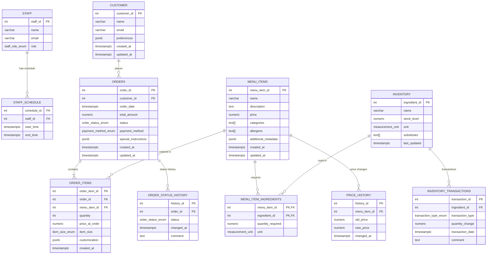

```mermaid
erDiagram
    %% Customers table: Tracks customer details and preferences
    CUSTOMER {
      int customer_id PK
      varchar name
      varchar email
      jsonb preferences
      timestamptz created_at
      timestamptz updated_at
    }

    %% Staff table: Stores staff details along with an ENUM role (e.g., barista, manager, cashier)
    STAFF {
      int staff_id PK
      varchar name
      varchar email
      staff_role_enum role
    }

    %% Staff schedules: Tracks work schedules for staff members
    STAFF_SCHEDULE {
      int schedule_id PK
      int staff_id FK
      timestamptz start_time
      timestamptz end_time
    }

    %% Orders table: Main order record with customer link, current status (ENUM) and special instructions (JSONB)
    ORDERS {
      int order_id PK
      int customer_id FK
      timestamptz order_date
      numeric total_amount
      order_status_enum status
      payment_method_enum payment_method
      jsonb special_instructions
      timestamptz created_at
      timestamptz updated_at
    }

    %% Order items: Each order can have multiple items; each records quantity, price at time of order,
    %% item size (ENUM) and customization options (JSONB)
    ORDER_ITEMS {
      int order_item_id PK
      int order_id FK
      int menu_item_id FK
      int quantity
      numeric price_at_order
      item_size_enum item_size
      jsonb customization
      timestamptz created_at
    }

    %% Menu items: Products available for sale with arrays for categories and allergen information, plus JSONB for extra metadata.
    MENU_ITEMS {
      int menu_item_id PK
      varchar name
      text description
      numeric price
      text[] categories
      text[] allergens
      jsonb additional_metadata
      timestamptz created_at
      timestamptz updated_at
    }

    %% Junction table between menu items and inventory (ingredients) with recipe quantities.
    MENU_ITEM_INGREDIENTS {
      int menu_item_id PK, FK
      int ingredient_id PK, FK
      numeric quantity_required
      measurement_unit unit
    }

    %% Inventory: Tracks available ingredients with current stock, unit (using an ENUM or text) and array for substitutes.
    INVENTORY {
      int ingredient_id PK
      varchar name
      numeric stock_level
      measurement_unit unit
      text[] substitutes
      timestamptz last_updated
    }

    %% Order status history: Tracks status changes over time for analytics and audit purposes.
    ORDER_STATUS_HISTORY {
      int history_id PK
      int order_id FK
      order_status_enum status
      timestamptz changed_at
      text comment
    }

    %% Price history: Tracks price changes for menu items over time.
    PRICE_HISTORY {
      int history_id PK
      int menu_item_id FK
      numeric old_price
      numeric new_price
      timestamptz changed_at
    }

    %% Inventory transactions: Records every inventory change (e.g., additions, subtractions) using an ENUM for type.
    INVENTORY_TRANSACTIONS {
      int transaction_id PK
      int ingredient_id FK
      transaction_type_enum transaction_type
      numeric quantity_change
      timestamptz transaction_date
      text comment
    }

    %% Relationships
    CUSTOMER ||--o{ ORDERS : "places"
    ORDERS ||--|{ ORDER_ITEMS : "contains"
    MENU_ITEMS ||--o{ ORDER_ITEMS : "ordered in"
    MENU_ITEMS ||--o{ MENU_ITEM_INGREDIENTS : "requires"
    INVENTORY ||--o{ MENU_ITEM_INGREDIENTS : "used in"
    ORDERS ||--o{ ORDER_STATUS_HISTORY : "status history"
    MENU_ITEMS ||--o{ PRICE_HISTORY : "price changes"
    INVENTORY ||--o{ INVENTORY_TRANSACTIONS : "transactions"
    STAFF ||--o{ STAFF_SCHEDULE : "has schedule"
```